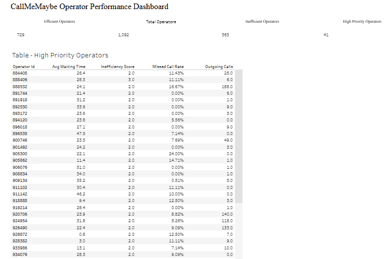

# CallMeMaybe Operator Efficiency Analysis

## Project Overview

CallMeMaybe is a virtual telephony service used by organizations that manage incoming and outgoing calls through multiple operators.

The goal of this project is to identify potentially inefficient operators using data-driven performance metrics and statistical analysis.

The analysis focuses on three main dimensions:

- Missed incoming-call rate
- Average waiting time
- Outgoing-call activity

---

## Business Objective

The main objective is to develop a framework that helps supervisors identify operators who may require additional review.

The project aims to:

- Measure operator performance
- Define transparent inefficiency criteria
- Identify potentially inefficient operators
- Prioritize high-risk cases
- Provide business recommendations

---

## Methodology

The analysis includes:

1. Data cleaning and preprocessing
2. Exploratory data analysis
3. Operator-level performance metrics
4. Data-driven threshold selection
5. Operator classification
6. Statistical hypothesis testing
7. Business interpretation and recommendations

For incoming-call metrics, only operators with at least **5 incoming calls** were considered when defining thresholds in order to avoid unstable rates caused by very low call volumes.

---

## Inefficiency Criteria

An operator may be flagged as potentially inefficient when one or more of the following conditions are met:

- Missed incoming-call rate above **5.08%**
- Average waiting time above **21.13 seconds**
- Fewer than **11 outgoing calls** among operators with outbound activity

Operators meeting at least two criteria are considered **high-priority cases**.

---

## Key Findings

The final classification identified:

- **729 operators** with no inefficiency criteria
- **363 potentially inefficient operators**
- **41 high-priority operators**

Performance differences were also observed between the two groups:

| Metric | Efficient Operators | Potentially Inefficient Operators |
|---|---:|---:|
| Missed incoming-call rate | 1.01% | 3.16% |
| Average waiting time | 14.08 sec | 23.89 sec |
| Average outgoing calls | 790.59 | 88.17 |

---

## Statistical Analysis

Mann–Whitney U tests showed statistically significant differences between efficient and potentially inefficient operators for:

- Missed incoming-call rate
- Average waiting time

These results support the separation observed between the two groups.

---

## Business Recommendations

Based on the analysis, supervisors should:

- Monitor missed-call rate and waiting time regularly
- Prioritize high-priority operators for further review
- Investigate workload and call-routing issues
- Provide targeted training when necessary
- Use low outgoing activity only when outbound calls are part of the operator's responsibilities
- Use the model as a screening tool rather than an automatic performance judgment

---

## Tools

- Python
- Pandas
- NumPy
- SciPy
- Matplotlib
- Jupyter Notebook
- Tableau

---

## Project Files

The repository includes:

- Jupyter Notebook with the complete analysis
- Cleaned datasets
- Tableau dashboard resources
- Final project presentation

---

## Dashboard Preview

---

## Interactive Dashboard

Explore the interactive Tableau dashboard:

[View the CallMeMaybe Operator Performance Dashboard on Tableau Public](https://public.tableau.com/app/profile/cristian.julian.rodriguez.valbuena/viz/CallMeMaybeOperatorPerformanceDashboard_17894336740170/Dashboard1)

---

## Author

**Cristian Julian Rodriguez Valbuena**  
Data Analyst